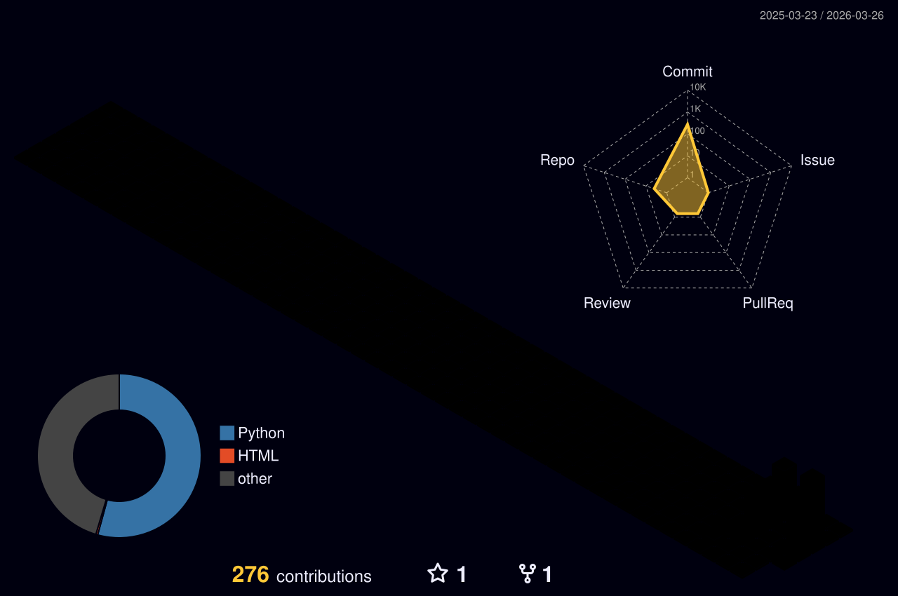

# 💫 About Me

  

---

## 🌐 Connect with Me

---

# 💻 Tech Stack

<table>
  <tr>
    <td valign="top" width="33%">
      <h3>🎨 Frontend</h3>
       
       
       
       
       
      
    </td>
    <td valign="top" width="33%">
      <h3>⚙️ Backend</h3>
       
       
       
      
    </td>
    <td valign="top" width="33%">
      <h3>🗄️ Database & Tools</h3>
       
       
       
       
      
    </td>
  </tr>
</table>

---

# 🏆 GitHub Trophies

  

---

# 📊 GitHub Analysis

  

  
  

  
  

---

# ⏱️ WakaTime Coding Stats

<!--START_SECTION:waka-->

  

<!--END_SECTION:waka-->

---

# 🧩 LeetCode Stats

  

---

# 🗓️ Contribution Heatmap

  

---

# 📈 Activity Graph

  

---

# 🏙️ GitHub Contribution City

  

---

# 🏔️ GitHub Contribution Skyline

  

---

# 🐍 Contribution Snake

  

---

# 🏃 Strava Running Stats

<!--START_SECTION:strava-->

  

  

  

<!--END_SECTION:strava-->

---

# 🔝 Featured Projects

  
  

---

# 🏅 Holopin Badges

  

---

# 😂 Dev Joke of the Day

  

---

# ✍️ Random Dev Quote

  

---

# 🎵 Recently Played on Last.fm

  

---

# 🌍 Visitor World Map

  

---

